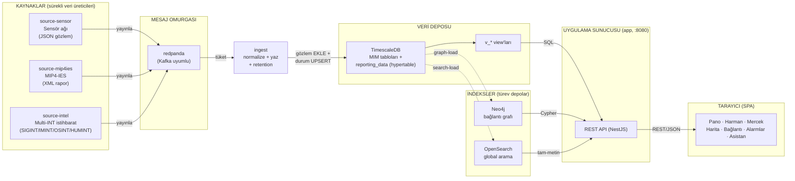
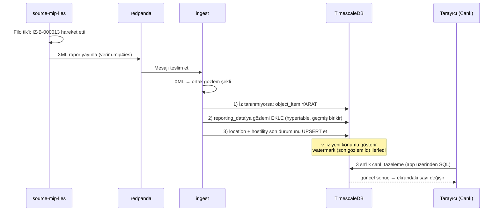
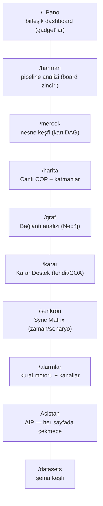
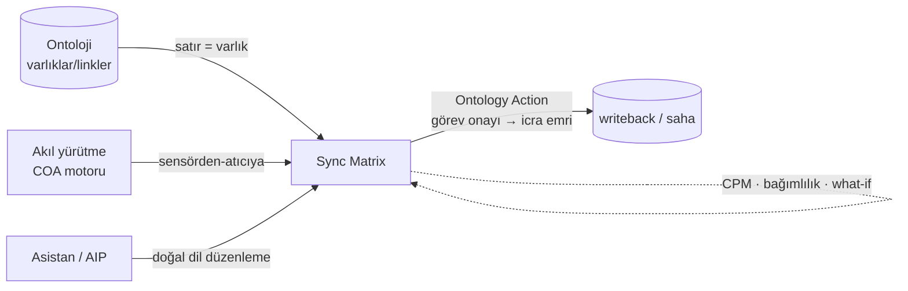
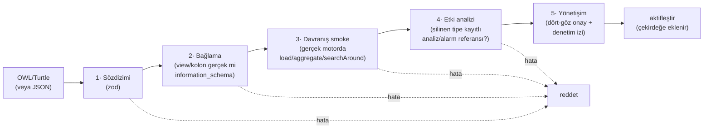

# Verim Mimarisi — Veri Nereden Gelir, Nasıl Akar?

Bu doküman sistemi **incelemek isteyen** biri için yazıldı: hangi Docker
servisi ne yapar, veri hangi aşamalardan geçer, tarayıcıdan bir istek
çıktığında neler olur. Diyagramlar Mermaid formatındadır (GitHub ve çoğu
Markdown görüntüleyici doğrudan çizer).

> Sistemi ilk kez duyanlar ve teknik olmayan sorular için:
> [SISTEM_REHBERI.md](SISTEM_REHBERI.md) — sunum + sık sorulanlar.
>
> **Mimari kararlar (ADR):** "Veri triple mı saklanmalı?" analizi ve kararı →
> [KARAR_TRIPLE_VS_ILISKISEL.md](KARAR_TRIPLE_VS_ILISKISEL.md) (özet: semantik
> sınırda — OWL/RDF ontoloji katmanında; depolama ilişkisel/graf/arama
> üçlüsünde kalır; tersine çevirme tetikleyicileri kayıtlı). Uygulama planı →
> [SPRINT_ONTOLOJI_YONETIMI.md](SPRINT_ONTOLOJI_YONETIMI.md).

---

## 1. Kuşbakışı: bütün sistem tek resimde



Okuma yönü soldan sağa: **kaynaklar üretir → omurga taşır → ingest yazar →
veritabanı saklar → indeksler türetilir → sunucu sorgular → tarayıcı
gösterir.** Hiçbir kaynak veritabanına doğrudan yazmaz; hiçbir ekran
veritabanına doğrudan bağlanmaz. Graf ve arama, ana deponun (Postgres/
TimescaleDB) **türev indeksleridir** — tek gerçeğin kaynağı staging'dir.

---

## 2. Docker servisleri: kim kime ne gönderiyor?

| Servis | Ne yapar | Kod |
|---|---|---|
| `db` | **TimescaleDB** (Postgres superset) — MIM staging + `reporting_data` hypertable | `db/schema.sql`, `db/views.sql` |
| `seed` | **Bir kere**: şemayı kurar, başlangıç verisini yükler, çıkar | `src/mim/seed.ts` |
| `redpanda` | Mesaj omurgası (Kafka uyumlu, tek binary) | — |
| `source-sensor` | IZ-A-… filosunu simüle eder, JSON gözlem yayınlar | `src/ingest/producer-sensor-sim.ts` |
| `source-mip4ies` | IZ-B-… filosunu XML rapor seti yayınlar | `src/ingest/producer-mip4ies.ts` |
| `source-intel` | SIGINT/IMINT/OSINT/HUMINT raporlarını **~25/sn** yayınlar; gözleme sub olup gerçek izlere korelasyonlar | `src/ingest/producer-intel.ts` |
| `ingest` | Topic'leri tüketir, normalize eder, yazar; intel retention | `src/ingest/ingest-service.ts` |
| `graphdb` | **Neo4j** — bağlantı analizi grafı (indeksli) | — |
| `graph-load` | **Bir kere**: varlık ağını (düğüm+kenar) Neo4j'ye yükler | `src/mim/graph-load.ts` |
| `opensearch` | **OpenSearch** — global nesne araması (tam-metin, fuzzy) | — |
| `search-load` | **Bir kere**: varlık nesnelerini OpenSearch'e indeksler | `src/search/search-load.ts` |
| `app` | REST API + web arayüzü (:8080) | `src/` (NestJS) + `public/` (SPA) |

Önemli ayrıntı: `source-*` servisleri **veritabanının varlığından bile
habersizdir** — sadece omurgaya yayın yaparlar. Veritabanına yazma yetkisi
olan tek akış bileşeni `ingest`'tir. Yarın gerçek bir kaynak (gerçek radar,
gerçek MIP4-IES alışverişi, gerçek istihbarat füzyon hattı) geldiğinde, o
kaynak sadece topic'e yazacak; sistemin geri kalanında tek satır değişmeyecek.

**Neden ayrı graf ve arama motoru?** Aynı soruyu üç farklı şekil için soruyoruz:
"bu izle kim ilişkili?" (graf gezinme → Neo4j), "içinde 'ANKA' geçen her nesne"
(tam-metin → OpenSearch), "Düşman izlerini domain'e göre say" (analitik → SQL).
Her biri kendi işine optimize edilmiş gerçek bir motordur; hiçbiri bellek-içi
taklit değildir.

---

## 3. Yazma yolu: bir gözlemin hayatı

"SNS-0042 sensörü, IZ-B-000013 izini 41.2K/29.1D'de gördü" olayının
uçtan uca yolculuğu:



Bu **üç yazma adımı** MIM modelinin doğal desenidir:

1. **Yarat** — ilk kez görülen iz bir `ObjectItem` olur (kimliği ingest'e
   ayrılmış 8M+ sayı aralığından; kaynak önekiyle çakışma imkânsız).
2. **Ekle** — her gözlem `reporting_data`'ya *yeni satır* (silinmez) →
   hareket geçmişi birikir. Bu tablo TimescaleDB **hypertable**'ıdır:
   günlük "chunk"lara bölünür, zaman-aralığı sorguları ve retention hızlanır.
3. **Upsert** — izin "şu anki hâli" (konum, sürat, sınıflandırma)
   `object_item_location` / `object_item_hostility_status`'ta tek satırdır;
   `v_iz` bu son durumu sunar.

**İstihbarat farklı akar:** `source-intel` rapor üretirken gözlem topic'ine
de **abone**dir; SIGINT/IMINT raporlarını yakın zamanda gözlenen gerçek izlere
bağlar (çok kaynaklı füzyon). Ingest bunları `intel_report` tablosuna FK'sız
(değer-bazlı iz referansı) yazar; sürekli akan raporlar için **retention**
eski kayıtları budar.

### Başlangıç verisi nereden geliyor? (seed)

İlk açılışta `seed` bir kere çalışır: MIM şemasını kurar (`reporting_data`'yı
extension varsa hypertable yapar) ve deterministik üreticiyle (sabit tohumlu
faker) **120 birlik, 400 platform, 250 sensör, 800 görev, 2.466 personel,
20.000 iz, 1.500 istihbarat raporu** yükler. Bu statik zemindir; üstüne canlı
kaynaklar akar. `IZ_SCALE=1000000` ile hacim testi için 1M ize şişer.
`graph-load` ve `search-load` bu zemini Neo4j ve OpenSearch'e türetir.

---

## 4. Okuma yolu: tarayıcıdan istek çıkınca ne olur?

### 4a. Mercek sorgusu (ObjectSet → SQL pushdown)

Kullanıcı Mercek'te kart zinciri kurar: *İzler → filtrele (Düşman) → grafiğe
dök (domain'e göre say)*. Tarayıcı bunu bir `ObjectSetDef` tarifi olarak
gönderir; `SqlObjectSetEngine` tarifi tek SQL'e derler (filtre→WHERE,
ilişki→JOIN/alt-sorgu, grafik→GROUP BY). **Pushdown:** 1M satırda bile ham
veri sunucuya taşınmaz, süzme/sayma veritabanının içinde biter.

### 4b. Harman sorgusu (board zinciri — filtre öneki SQL'e itilir)

Harman'ın board zinciri (filter/expression/histogram/pivot/enrich/setMath/
editColumns) `SqlPushdownQueryEngine` ile koşar: **baştan gelen filtre öneki
SQL WHERE'e itilir** (1M satırı belleğe çekmek yerine eşleşenler getirilir),
kalan board'lar `InMemoryQueryEngine`'in doğrulanmış mantığıyla işlenir.
İki yolun sonucu **birebir aynıdır** (eşdeğerlik testiyle kanıtlı). Türev/
materyalize dataset'ler tümüyle in-memory çalışır.

### 4c. Bağlantı grafı (Neo4j / Cypher)

`/graf` bir nesnenin komşularını `GRAPH_PROVIDER` portundan ister;
`Neo4jGraphProvider` varlık ağını (birlik/platform/sensör/görev/personel)
tek Cypher sorgusuyla indeksten okur. İz/gözlem telemetrisi (milyonlar) grafta
değil; motor üzerinden çözülür (hibrit mimari). Çok komşulu ilişkiler tek
"balon" düğümde toplanır, tıklayınca açılır.

### 4d. Global arama (OpenSearch)

TopNav'daki "Nesne ara" kutusu `/search`'e gider; `OpenSearchProvider`
`multi_match` + `fuzziness` ile etiket/özet/tüm-metin alanlarında arar.
Docker'sız dev ortamında bellek-içi fallback (`InMemorySearchProvider`) devreye
girer — API sabit kalır.

### 4e. Ontoloji isteği (menüler nereden biliyor?)

Mercek/graf/asistan açılırken `GET /ontology` çağrılır. `MimOntologyProvider`,
`mim-ontology.ts` eşlemesinden **8 nesne tipi + 20 ilişkiyi** üretip döner.
"Nesne ekle" menüsü, "ilişkiye geç" düğmeleri, filtre kolonu listeleri, hatta
asistanın bildiği tipler — hepsi bu tek cevaptan doğar (kopya bilgi yok).

### 4f. Canlı mod nasıl çalışıyor?

Üst bardaki **Canlı** anahtarı açıkken sorgular 3 sn'de bir tekrarlanır.
Cache neden bayat göstermez? Her dataset'in `version`'ı bir **watermark**
içerir: `mim-c2-v3#28030.3684` = "son gözlem 28030, son istihbarat 3684".
Ingest yeni veri yazınca sayı ilerler, sorgu anahtarları değişir, tazeleme
gerçek veriyi getirir.

---

## 5. Uygulamalar (tarayıcıdaki 10 yüzey)



| Uygulama | Rota | Ne yapar |
|---|---|---|
| **Pano** | `/` | Jira-tarzı birleşik dashboard; her öğe bir gadget (stat/grafik/tablo/harita/alarm/analiz/asistan/board/kart). Çapraz filtre. |
| **Ontoloji** | `/ontoloji` | Ontoloji Gezgini (salt-okunur) + **Yönetim** (`/ontoloji/yonetim`, admin): OWL/Turtle indir/yükle, 5 kademeli kabul hattı, dört-göz onay, sürüm/rollback. |
| **Harman** | `/harman` | Harman klonu: dataset + board zinciri (filter/chart/pivot/…), dashboard, çapraz filtre. |
| **Mercek** | `/mercek` | Mercek klonu: ontoloji-nesne kartları, ilişki gezinme, drill-down, graf/dashboard modları. |
| **Harita** | `/harita` | Canlı Ortak Harekât Resmi; nokta/ısı/iz-izi katmanları, **istihbarat** katmanı, **menzil halkaları**, **AOI** kutusu. |
| **Bağlantı** | `/graf` | Force-directed link-analysis grafı (Neo4j); balon gruplama, detay çekmecesi. |
| **Karar Destek** | `/karar` | Tehdit önceliklendirme (akıl yürütme writeback'i), ROE-uyumlu COA (angajman senaryoları), çok-kaynak durum özeti, angajman senkronizasyon matrisi. |
| **Sync Matrix** | `/senkron` | **Harekât senkronizasyonu**: çok-alanlı Gantt zaman çizelgesi, bağımlılık zinciri + kritik yol (CPM), dinamik yeniden planlama, kaynak çakışması, what-if senaryo, sensörden-atıcıya, **AIP doğal-dil düzenleme**. |
| **Alarmlar** | `/alarmlar` | Cümle-stili kural kurucu; zil + **webhook/e-posta** kanalları. |
| **Asistan** | çekmece / ⌘K | AIP karşılığı; doğal dille sorgu, sohbet-içi paneller, tıklanabilir aksiyonlar. |
| **Datasetler** | `/datasets` | Şema/kaynak keşfi. |

---

## 6. Sync Matrix — harekât senkronizasyonu (zaman/kaynak/senaryo)

Sync Matrix (`/senkron`), Karar Destek'in **zaman eksenindeki** kardeşidir: Karar
Destek "şu an hangi tehdit, hangi varlıkla?" derken, Sync Matrix "ne, ne zaman,
hangi sırayla?" sorusunu yönetir. Palantir MSS'teki Sync Matrix'in karşılığı —
gücünü **ontolojiden** alan bir orkestra şefi.

### Sistemdeki yeri



- **Ontoloji → satırlar.** Plandaki her varlık (platform/birlik) bir satırdır;
  bloğun süresi/konumu ontolojik özelliklerden (hız, rota) türetilebilir. Ontoloji
  değişirse atama kendiliğinden uyum sağlar — enum gömülü değildir.
- **Linkler → zamansal kısıtlar.** "X, Y'ye bağlıdır" ilişkisi "X bitmeden Y
  başlayamaz" bağımlılığına dönüşür.
- **Akıl yürütme (COA) → sensörden-atıcıya.** Yeni bir tehdit ontolojide
  belirince COA motoru en hızlı angajmanı hesaplar, Sync Matrix bunu otomatik bir
  angajman görevine çevirir.
- **AIP → doğal-dil düzenleme.** Asistan `senkron_plani_duzenle` aracıyla
  ("tüm birimleri 15 dk geri çek", "B planı senaryosu oluştur") planı saniyede yeniden dizer.
- **Ontology Action → writeback.** Bir görev onaylanınca (durum=onaylı) ilgili
  unsura icra emri iletilir (bugün simüle; saha sistemlerine çıkış noktası hazır).

### İlk planı KİM oluşturur? Planlar nasıl doğar?

1. **İlk plan sistemin kendisi tarafından, ontolojiden DETERMİNİSTİK türetilir.**
   İlk `GET /senkron/plan` çağrısında "canlı plan" yoksa `plan-seed.ts`
   ontolojideki platformları domain'e göre alır ve klasik bir müşterek harekât
   şablonu kurar: **Kara intikali → ISR keşif → SEAD/EW → hava taarruz → deniz
   desteği → BDA**, aralarında ön-koşul bağımlılıklarıyla. Böylece boş ekran
   yerine anlamlı bir başlangıç resmi doğar; H-saati o an damgalanır (`hEsRefISO`).
2. **Operatör düzenler.** Blok sürükle (dinamik yeniden planlama — bağlılar
   zincirlenir), görev ekle/sil/düzenle, bağımlılık kur/kaldır (döngü koruması),
   durum/onay.
3. **AIP düzenler.** Doğal dil komutları aynı servis metotlarına iner.
4. **Sensörden-atıcıya** yeni angajman görevleri ekler.
5. **What-if senaryo** dalları canlıyı bozmadan üretilir; motorla karşılaştırılır
   (süre kayması, kritik yol değişimi) ve uygun bulunan **canlıya terfi** edilir.

### Motor: neden deterministik?

Askeri denetlenebilirlik için karar mantığı LLM değil, saf/test edilebilir
algoritmalardır (`sync-engine.ts`):

- **Kritik yol (CPM)** — ileri/geri geçiş, bolluk, kritik zincir (gecikirse tüm
  operasyon gecikir → kırmızı hat).
- **Constraint propagation** — bir blok kayınca bağlı tüm sonraki adımlar ileri
  itilir (zincir kilitli kalır).
- **Kaynak çakışması** — aynı varlık iki göreve aynı anda atanamaz.
- **Bağımlılık ihlali** — operatörün yerleştirmesi ön-koşulu bozuyorsa uyarır.

Plan kalıcılığı `PlanStore` (yerel `.data/`, Cloud Run'da GCS). Uçlar:
`/senkron/plan · /kaydir · /gorev · /bagimlilik · /toplu-kaydir · /senaryo ·
/fark · /terfi · /sensor-to-shooter`. Dosyalar: `src/senkron/*`
(`plan-model`, `sync-engine`, `plan-seed`, `senkron.service`), frontend
`src/senkron/*` (`GanttTimeline`, `SyncMatrixPage`).

**Adım adım kullanım:** [SYNC_MATRIX_KILAVUZU.md](SYNC_MATRIX_KILAVUZU.md) —
ekran anatomisi, sürükleme/klavye, what-if akışı, AIP komut örnekleri, API uçları.

---

## 7. Katmanların haritası: hangi dosya ne iş yapar?

| Soru | Bakılacak yer |
|---|---|
| "Ontolojide hangi tipler/ilişkiler var, MIM'de neye karşılık geliyor?" | `verim-server/src/mim/mim-ontology.ts` |
| "İz/istihbarat verisi hangi tablolarda?" | `verim-server/db/schema.sql` (yorumlu) |
| "Verim'in gördüğü sade tablolar nasıl türetiliyor?" | `verim-server/db/views.sql` |
| "Mercek sorgusu SQL'e nasıl çevriliyor?" | `verim-server/src/mim/sql-object-set-engine.ts` |
| "Harman filtre öneki SQL'e nasıl itiliyor?" | `verim-server/src/mim/sql-query-engine.ts` |
| "Bağlantı grafı nasıl sorgulanıyor?" | `verim-server/src/mim/neo4j-graph.provider.ts` |
| "Global arama nasıl çalışıyor?" | `verim-server/src/search/*` |
| "Ontoloji OWL/Turtle'a nasıl aktarılıyor?" | `verim-server/src/ontology/owl-export.ts` (`GET /ontology.ttl`) |
| "Dış OWL dosyasından ontoloji nasıl yükleniyor?" | `owl-import.ts` + `admission/*` (5 kademeli kabul hattı) |
| "Uzantı yükleme kim, nasıl onaylar (yönetişim)?" | `admission/governance.service.ts` + `ontology-audit.ts` |
| "İstihbarat raporları nasıl üretiliyor?" | `verim-server/src/ingest/intel-feed.ts` |
| "Kaynaktan gelen mesaj nasıl işleniyor?" | `verim-server/src/ingest/ingest-service.ts` |
| "Alarm tetiklenince bildirim nasıl gidiyor?" | `verim-server/src/alerts/notifier.ts` |
| "Asistan hangi araçları biliyor?" | `verim-server/src/assistant/*` + `src/capabilities/*` |
| "Sync Matrix planı/motoru nerede?" | `verim-server/src/senkron/*` (`sync-engine.ts` = CPM/propagation/çakışma, `plan-seed.ts` = ilk plan) |
| "Canlı mod nasıl tetikleniyor?" | `verim-frontend/src/api/live.tsx` + hook'lar |

Her sınıfın tek tek ne yaptığı: [SISTEM_REHBERI.md](SISTEM_REHBERI.md) §"Sınıf sözlüğü".

---

## 8. Port & adapter (neden her şey değiştirilebilir?)

Sistem **hexagonal** kurulur: her dış bağımlılık bir **port** (arayüz)
arkasındadır, iki adapter'ı vardır — gerçek (mim) ve docker'sız dev (dummy).
`DATA_BACKEND`/`SEARCH_BACKEND` env'i hangisinin bağlanacağını seçer; API
sabit kalır.

| Port | Gerçek adapter | Dev fallback | Ne soyutlar |
|---|---|---|---|
| `ONTOLOGY_PROVIDER` | `MimOntologyProvider` | `DummyOntologyProvider` | Nesne tipleri + ilişkiler |
| `DATASET_PROVIDER` | `MimDatasetProvider` | `DummyDatasetProvider` | Ham tablo erişimi |
| `OBJECT_SET_ENGINE` | `SqlObjectSetEngine` | `ObjectSetEngine` (in-mem) | Mercek sorguları |
| `QUERY_ENGINE` | `SqlPushdownQueryEngine` | `InMemoryQueryEngine` | Harman board zinciri |
| `GRAPH_PROVIDER` | `Neo4jGraphProvider` | `DummyGraphProvider` | Bağlantı grafı |
| `SEARCH_PROVIDER` | `OpenSearchProvider` | `InMemorySearchProvider` | Global arama |

Bu yüzden "gerçek MIP information model" geldiğinde yalnızca adapter yazılır;
frontend, sorgu dili, asistan — hiçbiri değişmez.

### 8.1 Ontoloji uzantıları + kabul hattı (iki katmanlı model)

Ontoloji iki katmandır: **çekirdek** (iz/sensör/… — kodda, derleyici+drift
korumalı) ⊕ **uzantı** (yeni tip/link — dosyadan yüklenir). `ONTOLOGY_PROVIDER`
artık bir **CompositeOntologyProvider**'dır: `ONTOLOGY_EXTENSIONS=on` iken
aktif uzantı sürümünü çekirdeğe ekler; kapalıyken sistem bit-değişmez.

Dosyadan gelen bir uzantı, aktifleşmeden önce **5 kademeli kabul hattından**
geçer — koddaki "derlenmez" güvencesinin çalışma-zamanı karşılığı, üstelik
etki analiziyle daha güçlüsü:



Durum makinesi: `taslak → dogrulandi → onayli → aktif → arsiv`. Her sürüm
DEĞİŞMEZ (sha256'lı), her eylem denetim izine yazılır, tek tık **rollback**
(ilk uzantıda çekirdeğe dönüş). Asistan/Mercek/graf/arama YENİ tipi
kendiliğinden tanır (hepsi composite ontolojiden türer). Detay + karar
gerekçesi: [KARAR_TRIPLE_VS_ILISKISEL.md](KARAR_TRIPLE_VS_ILISKISEL.md),
[SPRINT_ONTOLOJI_YONETIMI.md](SPRINT_ONTOLOJI_YONETIMI.md).

---

## 9. Sistemi kendin incele: komut defteri

Hepsi `verim-server/` dizininden:

```bash
docker compose ps                              # hangi servisler ayakta?
docker compose logs -f ingest                  # ingest ne yazıyor (canlı)?
docker compose logs -f source-intel            # istihbarat akışı

# Omurgadan geçen HAM mesajlar:
docker compose exec redpanda rpk topic consume verim.gozlemler --num 2
docker compose exec redpanda rpk topic consume verim.istihbarat --num 2

# Kaynak bazında iz sayıları:
docker compose exec db psql -U postgres -d verim_mim -c "
  SELECT substring(alternate_identification_text from 1 for 5) AS kaynak, count(*)
  FROM object_item WHERE category_code='TRACK' GROUP BY 1 ORDER BY 1;"

# TimescaleDB hypertable chunk'ları:
docker compose exec db psql -U postgres -d verim_mim -c "
  SELECT hypertable_name, num_chunks FROM timescaledb_information.hypertables;"

# İstihbarat: disipline göre + ize korelasyon oranı:
docker compose exec db psql -U postgres -d verim_mim -c "
  SELECT intel_discipline_code, count(*) FROM intel_report GROUP BY 1 ORDER BY 2 DESC;"

# Arayüz: http://localhost:8080  (hvlamd/hvlamd)
```

En öğretici deney: iki terminalde `logs -f ingest` + tarayıcıda Canlı mod —
log'daki gözlem sayısıyla ekrandaki sayının birlikte yürüdüğünü görürsün.
Zincirin tamamı gözünün önünde çalışıyor demektir.
